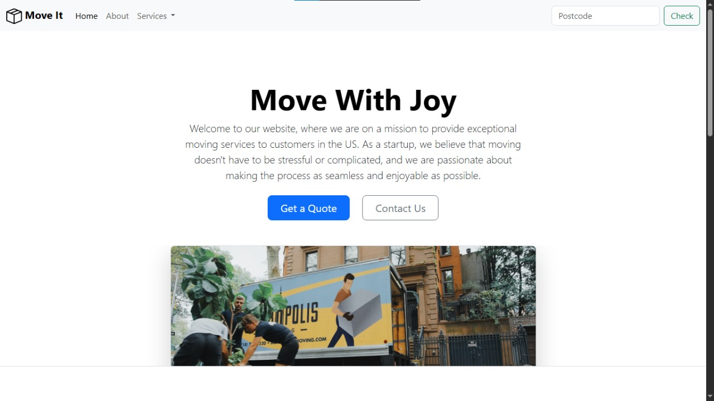

# 📦 Move It - Bootstrap Moving Company Landing Page

Welcome to **Move It**, a modern responsive landing page for a fictional moving company.  
Built as part of the [Dr. Angela Yu Web Development Bootcamp], this project demonstrates the use of Bootstrap 5 components to create a clean and professional UI.

---

## ✨ Features

- ✅ **Responsive Navbar** with dropdown menu and search bar  
- 📣 **Hero Section** with strong CTA buttons and engaging imagery  
- 🚚 **Feature Cards** explaining services (Professional, Countrywide, Personal Touch)  
- 🎠 **Image Carousel** highlighting moving experience visuals  
- 📦 **Custom Footer** with navigation links and copyright  
- ⚙️ Clean, mobile-first responsive layout using **Bootstrap 5.3**

---

## 📷 Screenshot



---

## 🚀 Technologies Used

- HTML5  
- CSS3 (with Bootstrap)  
- [Bootstrap 5.3 CDN](https://getbootstrap.com)  
- Icons and images stored locally in `/assets`

---

## 📁 Project Structure

```
index.html
/assets/
  ├── box-seam.svg
  ├── moving-van.jpg
  ├── briefcase.svg
  ├── bus-front.svg
  ├── chat-square-heart.svg
  ├── chevron-right.svg
  ├── couple.jpg
  ├── family.jpg
  └── dog.jpg
```

---

## 🛠️ How to Run Locally

1. Clone the repository:
   ```bash
   git clone https://github.com/yourusername/move-it-bootstrap.git
   cd move-it-bootstrap
   ```

2. Open `index.html` in your browser:
   ```bash
   open index.html
   ```

---

## 🧠 Lessons Learned

This project allowed me to:
- Practice building responsive layouts
- Apply Bootstrap components and grid system
- Enhance UI using cards, buttons, and carousels
- Work with icons and image placement

---

## ©️ Credits

> Developed by **Eng. Omar Nasser** – as part of practicing **Bootstrap Components**  
© 2025 Eng Omar Nasser, Inc.
